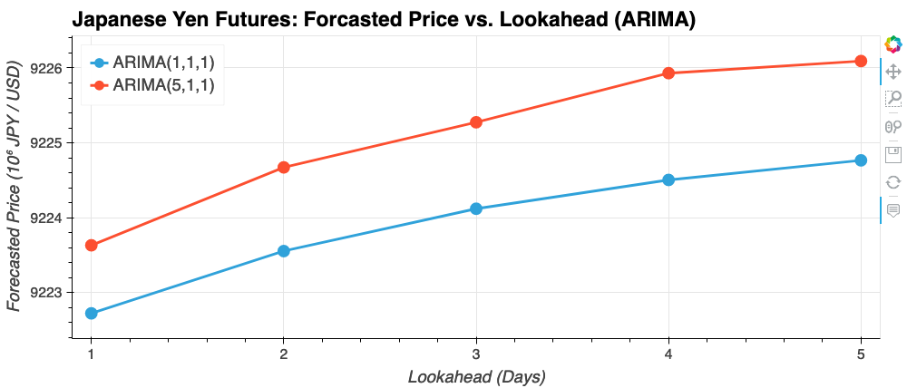

# Time Series Analysis

</img>
</img>

---

## Table of Contents

- [Introduction](#introduction)
- [Results](#results)
  - [Time-Series Forecasting](#time-series-forecasting)
    - [Hodrick-Prescott Filter](#hodrick-prescott-filter)
    - [Autoregressive moving average (ARMA)](#arma)
    - [Autoregressive integrated moving average (ARIMA)](#arima)
    - [Generalized autoregressive conditional heteroskedasticity (GARCH)](#garch)
  - [Linear-Regression Forecasting](#linear-regression-forecasting)
    - [Using Today's Returns to Predict Tomorrow's Profits](#using-todays-returns-to-predict-tomorrows-profits)
    - [Seasonality](#seasonality)
- [Conclusion](#conclusion)
- [How to Run the Code](#how-to-run-the-code)

---

## Introduction

The financial departments of large companies often deal with foreign currency transactions while doing international business.  As a result, companies are always looking for anything that can help them better understand the future direction and risk of various currencies.  Hedge funds, too, are keenly interested in anything that will give them a consistent edge in predicting currency movements.  In this GitHub repository, we investigate several time-series-analysis tools that enable us to predict future movements in the value of the Japanese Yen (JPY) versus the U.S. dollar (USD).  These tools readily generalize to any time series, e.g. stock markets, cryptocurrency, weather forecasting, etc.  The time-series analysis tools used below generally fall into two main categories:

1. Time-Series Forecasting
2. Linear-Regression Forecasting

## Results

### Time Series Forecasting

The following plots were created from the Jupyter Notebook "`timeseries-analysis.ipynb`."  The raw data are contained in the file `./data/jpy-usd-futures.csv`.  A plot of the raw data of the JPY/USD futures settle price vs. time generated with `pandas`/`hvplot`/`bokeh` is shown below.  See section [How to Run the Code](#how-to-run-the-code) if you'd like to generate any/all plots yourself! :thumbsup: :smile:

</img>

#### Hodrick-Prescott Filter

Much of the difficulty of financial time-series analysis comes from trying to separate out the signal from the noise.  The [Hodrick-Prescott Filter](https://en.wikipedia.org/wiki/Hodrick%E2%80%93Prescott_filter) is one such tool that allows an analyzer to decompose a time series into a noise component and a signal/trend component.  The Hodrick-Prescott Filter (HP) essentially "smooths out" jagged timeseries by implementing a *curvature penalty.*  The curvature penalty is an input parameter to the HP filter that has the following effect: When the curvature penalty is high, the HP solution reduces to the *line of best fit*, since lines have zero curvature!  When the curvature penalty is low, the HP solution reduces to the input timeseries itself, since this is what minimizes the mean-squared-error of the model compared to the data.  Intermediate values of the curvature penalty lead to HP solutions that more closely follow the input timeseries than linear regression but that are less jagged than the raw timeseries.  Using the HP filter, it is easy to decompose the input timeseries into a "trend" and "noise" component, as shown in the plot below.

</img>

#### ARMA

[Autoregressive moving average (ARMA)](https://en.wikipedia.org/wiki/Autoregressive%E2%80%93moving-average_model) models are commonly used in econometrics, finance, and signal processing for representing [timeseries](https://en.wikipedia.org/wiki/Time_series) of a single real variable in an attempt to make predictions of future values.  The autoregressive (AR) component of the ARMA model attempts to describe the current value of the input timeseries using lagged values of the timeseries data.  The moving-average (MA) component of the ARMA model attempts to describe the noise (a.k.a. "uncertainty" or "error") of the timeseries using lagged versions of the error.  The plot below shows a couple of ARMA models that allow us to make predictions about future JPY/USD returns.  The ARMA models suggest that the price of the Japanese Yen will increase over the next 5 days relative to the U.S. Dollar (since the forecasted returns are *positive*, i.e. larger than zero).  This suggest a near-term buying opportunity exists in JPY/USD futures.

</img>

#### ARIMA

[Autoregressive integrated moving average (ARIMA)](https://en.wikipedia.org/wiki/Autoregressive_integrated_moving_average) models of input timeseries are similar to [ARMA](#arma) models, with one key difference: ARIMA models have an additional step that makes the timeseries *stationary*, i.e. the average value of the timeseries is made to be constant (unchanging) with respect to time.  Enforcing stationarity is usually accomplished by taking the first-order [finite difference](https://en.wikipedia.org/wiki/Finite_difference_coefficient).  When the ARIMA model is used to make predictions about future values of the timeseries, the finite differencing is simply "integrated out" (undone), hence the "I" in the name "ARIMA."

The plot below shows future Japanese Yen values as forecast by a couple of ARIMA models.  Notice that the vertical axis of the plot below is the actual price of JPY/USD futures, not the daily return values as was the case for the ARMA model.  This is because the data are made stationary in the ARIMA model by taking the first-order finite difference, which effectively converts daily price to daily return like with the ARMA model.  Essentially, ARIMA models are generalized ARMA models.  Like the ARMA models, the ARIMA models predict the price of JPY/USD will be increasing in the coming days.  Hence, a near-term investment opportunity exists in JPY/USD futures.

</img>

#### GARCH

[Generalized autoregressive conditional heteroskedasticity (GARCH)](https://en.wikipedia.org/wiki/Autoregressive_conditional_heteroskedasticity) models are essentially ARMA models of the variance (a.k.a. "volatility") of the price returns.  In the plot below, the red shaded regions shows the results of a GARCH(1,1) model of the JPY/USD future daily returns vs. time.  The volatility is said to be *heteroskedastic* when the variance is not constant with respect to time (as is the case below).  GARCH models are used in practice to predict future values of the volatility.  In the case of JPY/USD, the volatility is expected to increase slightly by ~0.1% in the coming days, which may influence our decision to buy/sell the financial instrument.

</img>

---

### Linear Regression Forecasting

All plots below were created from the Jupyter Notebook "`regression-analysis.ipynb`."  See section [How to Run the Code](#how-to-run-the-code) if you'd like to generate any/all plots yourself! :thumbsup: :smile:

#### Using Today's Returns to Predict Tomorrow's Profits

The purpose of this section is to determine if *today's* returns can be used to predict *tomorrow's* returns using [linear regression](https://en.wikipedia.org/wiki/Linear_regression).  This process involves first splitting the data into two sets: (1) the "training" set for fitting the model and (2) the "testing" set for assessing the validity the model.  The linear-regression model is fit on the training set and a performance measure such as the root-mean-squared-error (RMSE) is used to assess the validity of the models.  The RMSE for the training and testing data are shown in the table below.

DATASET | RMSE (%)
--------|---------
TRAIN   | 0.71%
TEST    | 0.41%

</img>

Notice that, since the constant offset and slope of the linear-regression model are both consistent with zero, the RMSE of the linear-regression model is effectively the volatility of the returns.  The volatility of the training dataset (i.e. prior to 2018) is larger than the volatility of the testing dataset (i.e. 2018 onward), which can easily be seen by eye in the plots of the previous sections.  Therefore, it is hardly a surprise that the RMSE of the fitted model on the *training* set is larger than the RMSE of the fitted model on the *testing* set.  Notice also that a linear-regression model is equivalent to an AR(1) = ARMA(1,0) = ARIMA(1,0,0) model.  With not too much trouble, we can promote the linear-regression model of the returns from an AR(1) model to an ARIMA(1,1,1) model of the price, which has the additional benefit that timeseries errors are taken into account in the model.  Bottom Line: Use an ARIMA(1,1,1) model of the price over a linear-regression model.

#### Seasonality

As a first attempt at addressing [seasonality](https://en.wikipedia.org/wiki/Seasonality), I grouped the daily returns by month, as shown in the plot below.  For me, the key takeaway is that all months appear to have a mean/median return that is statistically consistent with zero.  Therefore, adages like "sell in May and walk away" probably do not to apply to JPY/USD futures!  It remains on my list of TODOs to investigate more complicated models such as [Seasonal AutoRegressive Integrated Moving Average with eXogenous regressors (SARIMAX)](https://www.statsmodels.org/dev/generated/statsmodels.tsa.statespace.sarimax.SARIMAX.html).  In the near term, let's invest in JPY/USD futures! :moneybag: :tada:

</img>

---

## Conclusion

Time Series Forecasting:

1. ***Based on the time-series analysis, would you buy the yen now?***  Yes, I would buy the yen: The ARMA models predict positive returns over the next 5 days.  Likewise, the ARIMA models predict increasing settle prices over the next 5 days.  Thus, if we invest in the yen now, we should make money in the near term.
2. ***Is the risk of the yen expected to increase or decrease?***  Increase.  The GARCH models predicts slightly elevated volatility over the next 5 days.  The increase to the volatility is only ~0.1% (annualized), which not zero, but small.
3. ***Based on the model evaluation, would you feel confident in using these models for trading?***  Yes.  From the two bullet points above, we can expect a positive returns (reward) in the next 5 days with only a small increase in volatility (risk).  This means that the reward-to-risk ratio is likely better/higher over the next 5 days, i.e. it is probably a good time to buy JPY/USD futures for profit in the near term.

Linear Regression Forecasting:

- Fitting a linear model to the daily returns is conceptually like fitting an AR(1) = ARMA(1,0) = ARIMA(1,0,0) model to the daily *returns*, or equivalently an ARAMIA(1,1,0) model to the *price*.
- Fitting an ARMA(1,1) model to the daily returns is better than fitting a simple linear/AR(1) model to the daily returns, because the ARMA(1,1) model also takes into account how the noise in the timeseries *yesterday* influences the noise in the timeseries *today*.
- The ARMA(1,1) model shows that all parameters are statistically consistent with zero.  For example, the constant offset has a predicted value of `const = 5.973e-05` with a standard error of `std_err = 8.55e-05`, leading to a z-score of `z = 0.699`.  Since `P>|z| = 0.485 > 0.05`, we accept the null hypothesis that the average return is zero.
- Both the linear model and the ARMA(1,1) model of Japanese Yen futures daily returns have an RMSE of about 0.7%.  This makes sense since all model parameters are consistent with zero, leaving only how the daily returns are distributed about zero.  Thus, these models are essentially analyzing the volatility, e.g. the RMSE.
- The training data (i.e. data up to 2018) is more volatile than the testing/validation data (i.e. data 2018 and later).  This can easily be seen by eye when looking at a price-vs-time chart.  This explains why the RMSE of the training data is larger than the RMSE of the testing/validation data.
- The daily return of Japanese Yen Futures seems to be consistent with zero independent of month.  Therefore, it seems unlikely there are seasonal effects in the price of JPY/USD futures.

---

## How to Run the Code

The installation instructions shown below were verified to work on MacOS 10.15 ("Catalina"), Windows 10, and Ubuntu 20.04 using [Anaconda](https://anaconda.org/) as a Python package manager.  After you install the required Python packages, you should be able to launch a Jupyter Lab/Notebook and run `timeseries-analysis.ipynb` and `regression-analysis.ipynb` yourself -- have fun! :thumbsup: :smile:

```bash
# Example installation of Python packages with Anaconda
(base) $  conda update conda  # make sure you're up to date
(base) $  conda update --all  # double-check to be sure!
(base) $  conda create --name timeseries-analysis python=3.7  # create new environment
(base) $  conda activate timeseries-analysis  # activate the newly created environment
(timeseries-analysis) $  conda install anaconda hvplot selenium  # most of what we need
(timeseries-analysis) $  conda install -c conda-forge panel  # plotting + dashboarding
(timeseries-analysis) $  pip install arch  # [G]ARCH volatility analysis

# Firefox users may need to do this:
(timeseries-analysis) $  conda install -c conda-forge firefox geckodriver

# Finally, launch Jupyter Notebook/Lab and run the code!
(timeseries-analysis) $  jupyter-lab
```
