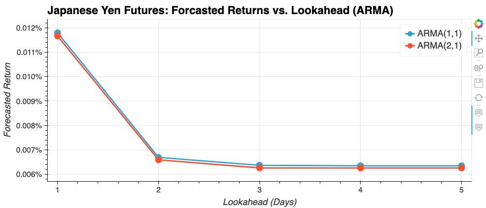

# Time Series Analysis

</img>
</img>

---

## Table of Contents

- [Introduction](#introduction)
- [Installation Notes](#installation-notes)
- [Time-Series Forecasting](#time-series-forecasting)
  - [Hodrick-Prescott Filter](#hodrick-prescott-filter)
  - [ARMA](#arma)
  - [ARIMA](#arima)
  - [GARCH](#garch)
- [Linear-Regression Forecasting](#linear-regression-forecasting)
  - [Using Today's Returns to Predict Tomorrow's Profits](#using-todays-returns-to-predict-tomorrows-profits)
  - [Seasonality](#seasonality)
- [Conclusion](#conclusion)

---

## Introduction

The financial departments of large companies often deal with foreign currency transactions while doing international business.  As a result, companies are always looking for anything that can help them better understand the future direction and risk of various currencies.  Hedge funds, too, are keenly interested in anything that will give them a consistent edge in predicting currency movements.  In this GitHub repository, we investigate several time-series-analysis tools that enable us to predict future movements in the value of the Japanese Yen (JPY) versus the U.S. dollar (USD).  The time-series analysis tools fall into two main categories:

1. Time-Series Forecasting
2. Linear-Regression Forecasting

---

## Installation Notes

```bash
# Example installation of Python packages with Anaconda
(base) $  conda update conda  # make sure you're up to date
(base) $  conda update --all  # double-check to be sure!
(base) $  conda create --name timeseries-analysis python=3.7  # create new environment
(base) $  conda activate timeseries-analysis  # activate the newly created environment
(timeseries-analysis) $  conda install anaconda hvplot selenium  # most of what we need
(timeseries-analysis) $  conda install -c conda-forge panel  # plotting + dashboarding
(timeseries-analysis) $  pip install arch  # ARIMA/GARCH in timeseries analysis
(timeseries-analysis) $  jupyter-lab  # you should be able to run the code now!

# Note, users of Firefox web browser may need to do this:
(timeseries-analysis) $  conda install -c conda-forge firefox geckodriver
```

---

## Time Series Forecasting

### Raw Data

</img>

</img>

### Hodrick-Prescott Filter

[Hodrick-Prescott Filter](https://en.wikipedia.org/wiki/Hodrick%E2%80%93Prescott_filter)

</img>

### ARMA

[Autoregressive–moving-average (ARMA)](https://en.wikipedia.org/wiki/Autoregressive%E2%80%93moving-average_model)

</img>

### ARIMA

[Autoregressive integrated moving average (ARIMA)](https://en.wikipedia.org/wiki/Autoregressive_integrated_moving_average)

</img>

### GARCH

[Generalized autoregressive conditional heteroskedasticity (GARCH)](https://en.wikipedia.org/wiki/Autoregressive_conditional_heteroskedasticity)

</img>

</img>

---

## Linear Regression Forecasting

### Using Today's Returns to Predict Tomorrow's Profits

[Linear Regression](https://en.wikipedia.org/wiki/Linear_regression)

</img>

### Seasonality

[Seasonality](https://en.wikipedia.org/wiki/Seasonality)

</img>

---

## Conclusion

Here will be a quick summary of important findings.